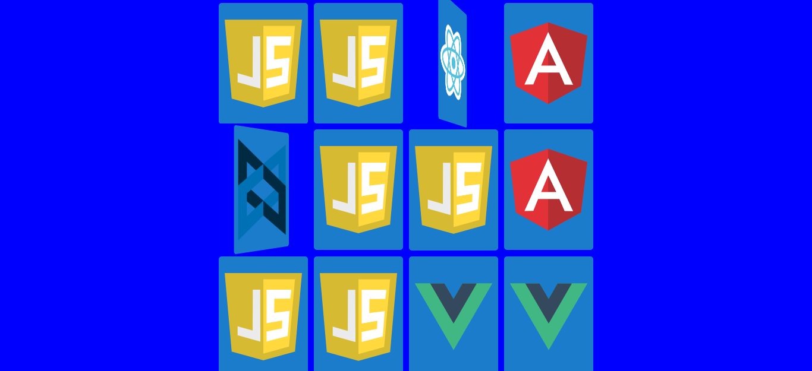

# Memory Game - Vanilla JavaScript

I have written this code following the video of the Brazilian [Marina Ferreira](https://www.youtube.com/watch?v=ZniVgo8U7ek)for Freecodecamp.

* ✏️ Wriiten Tutorial: <a href="https://marina-ferreira.github.io/tutorials/js/memory-game/" target="_blank">Memory Game Tutorial</a>

Project developed in vanilla javascript. Learn the fundamentals of pure javascript in a 30 minute project. No frameworks or libraries used.

## Display

This tutorial will cover how to:

* select elements in the DOM with querySelector
* iterate through lists with forEach
* add/remove an element class
* add/remove event listeners
* timeout
* html5: data-attribute
* css3: positioning, flexbox, perspective, backface-visibility, transitions

